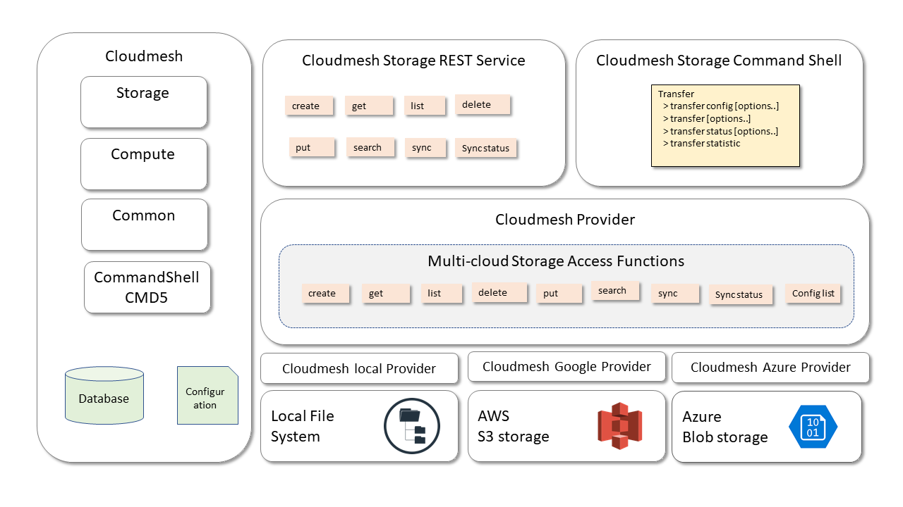

# Cloudmesh File Transfer Service for AWS S3, Azure Blob, Oracle and Google
# cloud storage

Ketan Pimparkar, kpimpark@iu.edu, [fa19-516-155](https://github.com/cloudmesh-community/fa19-516-155)

* [Contributors](https://github.com/cloudmesh-community/fa19-516-155/graphs/contributors)
* [Insights](https://github.com/cloudmesh-community/fa19-516-155/pulse/monthly)
* [Code](https://github.com/cloudmesh/cloudmesh-storage)

## Objective

Provide cloudmesh users an API to transfer files,directories from data
storage of one cloud service provider to other cloud service provider.
This package will consider AWS S3 and Azure Blob storage for current
implementation.

## Motivation

Cloud technology evolves at a very fast rate. Due to which, policies and
facilities provided by cloud service providers change as well. There
could be various practical scenarios in which users want to transfer the
data currently stored in AWS S3 to Azure Blob. Such scenarios could be
change in pricing policy or storage capacity rules of AWS S3 or Azure
Blob.

Cloudmesh is a multicloud platform. With inclusion of data transfer
service, a highly optimized and simple to use methods will be made
available to cloudmesh users.

## Architecture

* Architecture diagram:



Diagram credit: Prof. Gregor

## Technology

* AWS S3
* Azure blob storage
* Python 3.7
* cloudmesh storage
* OpenAPI 3.0.2
* REST

## Usage

### cms storage copy command

`cms storage` code base is enhanced to allow copying of files between two
cloud storage providers. This code is available at [cloudmesh storage.](https://github.com/cloudmesh/cloudmesh-storage)

* Supported cloud storages:
  * AWS S3
  * Azure Blob Storage
  * Oracle object storage
  * Google cloud storage
  * Local storage provider

```
   Usage:
       storage copy SOURCE DESTINATION

   Description:
       Copies files from source storage to destination storage.
       The syntax of SOURCE and DESTINATION is:
       SOURCE - awss3:source.txt
       DESTINATION - azure:target.txt

   Example:
       storage copy azure:source.txt oracle:target.txt
```

* Sample commands for `cms storage copy`:

> Copy file from google cloud storage to local storage

```bash
$ cms storage copy google:newfolder/anew.txt local:'~/cmStorage'
```

> Copy file from oracle storage to google storage

```bash
$ cms storage copy oracle:a.txt google:
```

### cms transfer command (Deprecated - moved to storage copy)

* [cms transfer manual](https://github.com/cloudmesh-community/fa19-516-155/blob/master/project/transfer.md)
* [Code](https://github.com/cloudmesh/cloudmesh-transfer)

```
Usage:
   transfer copy --source=awss3:source_obj --target=azure:target_obj [-r]
   transfer list --target=awss3:target_obj
   transfer delete --target=awss3:target_obj


 This command is part of Cloudmesh's multi-cloud storage service.
 Command allows users to transfer files/directories from storage of
 one Cloud Service Provider (CSP) to storage of other CSP.
 Current implementation is to transfer data between Azure blob
 storage and AWS S3 bucket.
 AWS S3/ Azure Blob storage credentials and container details will
 be fetched from storage section of "~\.cloudmesh\cloudmesh.yaml"


 Arguments:
   awss3:source_obj  Combination of cloud name and the source object name
   source_obj        Source object. Can be file or a directory.
   azure:target_obj  Combination of cloud name and the target object name
   target_obj        Target object. Can be file or a directory.
   transfer_id       A unique id/name assigned by cloudmesh to each
                     transfer instance.


 Options:
   --id=transfer_id            Unique id/name of the transfer instance.
   -h                          Help function.
   --source=aws:source_obj     Specify source cloud and source object.
   --target=azure:target_obj   Specify target cloud and target object.
   -r                          Recursive transfer for folders.


 Description:
   transfer copy --source=<awss3:source_obj>
                 --target=<azure:target_obj> [-r]
       Copy file/folder from source to target. Source/target CSPs
       and name of the source/target objects to be provided.
       Optional argument "-r" indicates recursive copy.

   transfer list --target=awss3:target_obj
       Enlists available files on target CSP at target object

   transfer delete --target=awss3:target_obj
       Deletes target object from the target CSP.

 Examples:
   transfer copy --source=awss3:sampleFileS3.txt
                 --target=azure:sampleFileBlob.txt

```

Examples of  commands for `cms transfer`:

> Enlist content of the target location

```bash
$ cms transfer list --target=azure:
```

> Delete a file from target storage

```bash
$ cms transfer delete --target=awss3:a.txt
```

> Copy file from source storage to target storage

```bash
cms transfer copy --source=awss3:anew.txt --target=azure:
```

## Benchmarks

* [storage copy benchmarks](https://github.com/cloudmesh-community/fa19-516-155/blob/master/project/storage_copy_benchmarks.txt)

* Benchmark results:


* [Transfer Benchmarks](https://github.com/cloudmesh/cloudmesh-transfer/blob/master/cloudmesh/transfer/tests/transfer-kpimparkar.txt)

## Testing

* PyTests:

  * [cms storage pytests](https://github.com/cloudmesh/cloudmesh-storage/blob/master/tests/test_storage_copy.py)
  * [cms transfer pytests](https://github.com/cloudmesh/cloudmesh-transfer/blob/master/cloudmesh/transfer/tests/test_transfer.py)

* Results of pytest execution:

  * [Results cms storage copy pytests](https://github.com/cloudmesh-community/fa19-516-155/blob/master/project/storage_copy_benchmarks.txt)
  * [Results cms transfer pytests](https://github.com/cloudmesh/cloudmesh-transfer/tree/master/cloudmesh/transfer/tests)

## Project features

* `cms storage copy` command:
  * Copy command allows users to copy files between five cloud storage, which
    are: AWS S3, Azure blob storage, Google cloud storage, Oracle cloud
    storage and local storage.
  * Pytests are created to test copy command with files of various sizes such
    as 1 MB and 10 MB.
  * Benchmarking is done to evaluate performance of copy command between
    mentioned cloud storages.

* `cms transfer` command:
  * Methods such as list/delete/copy are implemented using cloudmesh storage
    providers. [cms-transfer](https://github.com/cloudmesh/cloudmesh-transfer)
  * Pytests and benchmarks are done.

* cms cloud 1_local modifications:
  * Modifications to the 1_local test were done for windows. [Code](https://github.com/cloudmesh/cloudmesh-cloud/tree/master/tests/1_local)

## Configuration

### .yaml file configuration

* Location of .yaml file: `C:\Users\{User}\.cloudmesh\cloudmesh.yaml`
* Local storage configuration:

```bash
cloudmesh:
  storage:
    ...
    local:
      cm:
        s3active: true
        blobactive: true
        heading: local_to_CSP
        host: localhost
        kind: local
        label: local_storage
        version: 0.1
        service: storage
      default:
        directory: ~\cmStorage
      credentials:
        userid: None
        password: None
```

* default.directory is the location of local storage
* AWS S3 storage configuration:

```bash
cloudmesh:
  storage
    ...
    awss3:
      cm:
        active: false
        heading: homedir
        host: aws.com
        label: home-dir
        kind: awss3
        version: TBD
        service: storage
      default:
        directory: /
      credentials:
        access_key_id: XXX
        secret_access_key: XXX
        bucket: XXX
        region: us-east-2
```

* Azure Blob storage configuration:

```bash
cloudmesh:
  storage:
    ...
    azure:
      cm:
        active: false
        heading: AWS
        host: azure.mocrosoft.com
        label: azure_blob
        kind: azureblob
        version: TBD
        service: storage
      default:
        resource_group: Cloudmesh
        location: 'East US'
      credentials:
        account_name: ***
        account_key: ***
        container: transferreddata
        AZURE_TENANT_ID: xxxxxx-xxxx-xxxx-xxxx-xxxxxxxxxxxx
        AZURE_SUBSCRIPTION_ID: xxxxxx-xxxx-xxxx-xxxx-xxxxxxxxxxxx
        AZURE_APPLICATION_ID: xxxxxx-xxxx-xxxx-xxxx-xxxxxxxxxxxx
        AZURE_SECRET_KEY: TBD
        AZURE_REGION: northcentralus    """
```

## Limitations

* Currently `cms storage copy` command uses local storage as intermediate
  storage for copying files between two cloud storage services.

* Further research is needed to check if utilities such as `azcopy` are
  available to copy files from one cloud storage to another without using
  intermediate local storage.

* azcopy implementation from AWS S3 to Azure Blob copy is required

## References

* AzCopy <https://docs.microsoft.com/en-us/azure/storage/common/storage-use-azcopy-s3?toc=%2fazure%2fstorage%2fblobs%2ftoc.json>
* AWS Boto3 API <https://boto3.amazonaws.com/v1/documentation/api/latest/index.html?id=docs_gateway>
* Cloudmesh manual <https://cloudmesh.github.io/cloudmesh-manual/preface/about.html>
* Install Azure python SDK <https://docs.microsoft.com/en-us/azure/python/python-sdk-azure-install>
* Azure python API usage <https://github.com/Azure-Samples/storage-blobs-python-quickstart/blob/master/example.py>
* Cloud computing book by Gregor von Laszewski <https://laszewski.github.io/book/cloud/>
* cloudmesh-cloud <https://cloudmesh.github.io/cloudmesh-manual/manual-compute.html>
* cloudmesh-storage <https://cloudmesh.github.io/cloudmesh-manual/concepts/storage.html>
