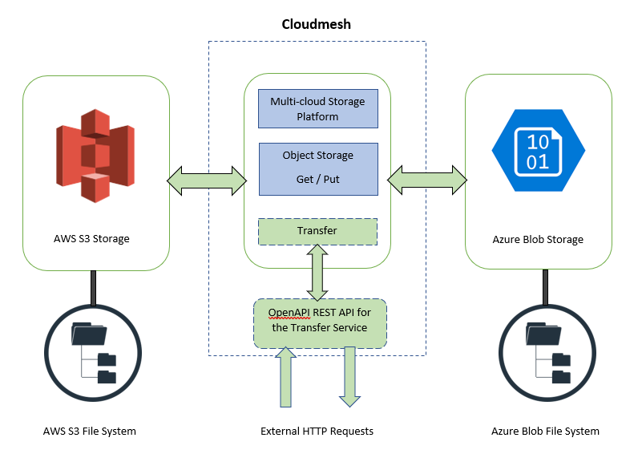

# Cloudmesh Data Transfer Service for AWS S3 and Azure Blob

Ketan Pimparkar, [fa19-516-155](https://github.com/cloudmesh-community/fa19-516-155)

## Abstract

TBD

## Objective

Provide cloudmesh users an API and REST service to transfer files,
directories from data storage of one cloud service provider to other
cloud service provider. This packge will consider AWS S3 and Azure Blob
storage for current implementation.

## Motivation

Cloud technology evolves at a very fast rate. Due to which, policies and
facilities provided by cloud service providers change as well. There
could be various practical scenarios in which users want to transfer the
data currently stored in AWS S3 to Azure Blob. Such scenarios could be
change in pricing policy or storage capacity rules of AWS S3 or Azure
Blob.

Cloudmesh is a multicloud platform. With inclusion of data transfer
service, a highly optimized and simple to use methos will be made
available to cloudmesh users.

## Architecture

* Architecture diagram:



## Technology

* AWS S3
* Azure blob storage
* Python
* cloudmesh storage
* OpenAPI 3.0.2
* REST

## Usage

* API:
* The code is available [here](https://github.com/cloudmesh-community/fa19-516-155/tree/master/cloudmesh-transfer)

```
Usage:
    transfer config [--file=ip_file]
    transfer --id=<transfer_id> --data=<file_name> [--copy=True|False]
    transfer status --id=<transfer_id>
    transfer statistic

This command is part of CloudMesh's multicloud storage service.
Command allows users to transfer files/directories from storage of one
Cloud Service Provider (CSP) to storage of other CSP. Current
implementation is to transfer data between Azure blob storage and AWS
S3 bucket.

Arguments:
  transfer_id   A unique id/name assigned by user to each transfer
                instance
  file_name     Name of the file/directory to be transferred
  Boolean       True/False argument for --copy option. When False,
                data will be removed from source location
  ip_file       Input file used to configure 'transfer' command

Options:
  --id=transfer_id        Specify a unique i/name to the transfer
                          instance
  --data=file_name        Specify the file/directory name to be
                          transferred
  --copy=True|False       Specify is the data should be kept in
                          source location after the transfer
  --file=ip_file          Specify the file to be used for
                          configuration of the transfer instance
  -h                      Help function

Description:
  transfer config [options..]
        Configures source/destination and authentication details
        to be used by transfer command

  transfer [options..]
        Transfers file/directory from storage of one CSP to
        storage of another CSP

  transfer status [options..]
        Returns status of given transfer instance

  transfer statistic
        Returns statistics of all transfer processes

Examples:
  transfer --id="Dummy transfer" --data=dummy_file.txt --copy=True
```

* REST service:

TBD

## References

* <https://docs.microsoft.com/en-us/azure/storage/common/storage-use-azcopy-s3?toc=%2fazure%2fstorage%2fblobs%2ftoc.json>
* <https://boto3.amazonaws.com/v1/documentation/api/latest/index.html?id=docs_gateway>
* <https://docs.microsoft.com/en-us/azure/python/python-sdk-azure-install>
* <https://cloudmesh.github.io/cloudmesh-manual/preface/about.html>

## Benchmarks

TBD 

* Benchmark report to be created

## Testing

TBD 

* PyTest report to be created

## Progress

* done. Installation of Cloudmesh and mongoDB in Windows10 Pro system
* done. Creation of AWS EC2 instance and S3 buckets
* done. Access AWS account using Cloudmesh CLI
* done. Define architecture of the transfer service
* done. [Define docopt of the transfer service](https://github.com/cloudmesh-community/fa19-516-155/tree/master/cloudmesh-transfer)
* Define test cases
* Creation of Azure account
* Copy files from local storage to AWS S3 and Azure Blob
